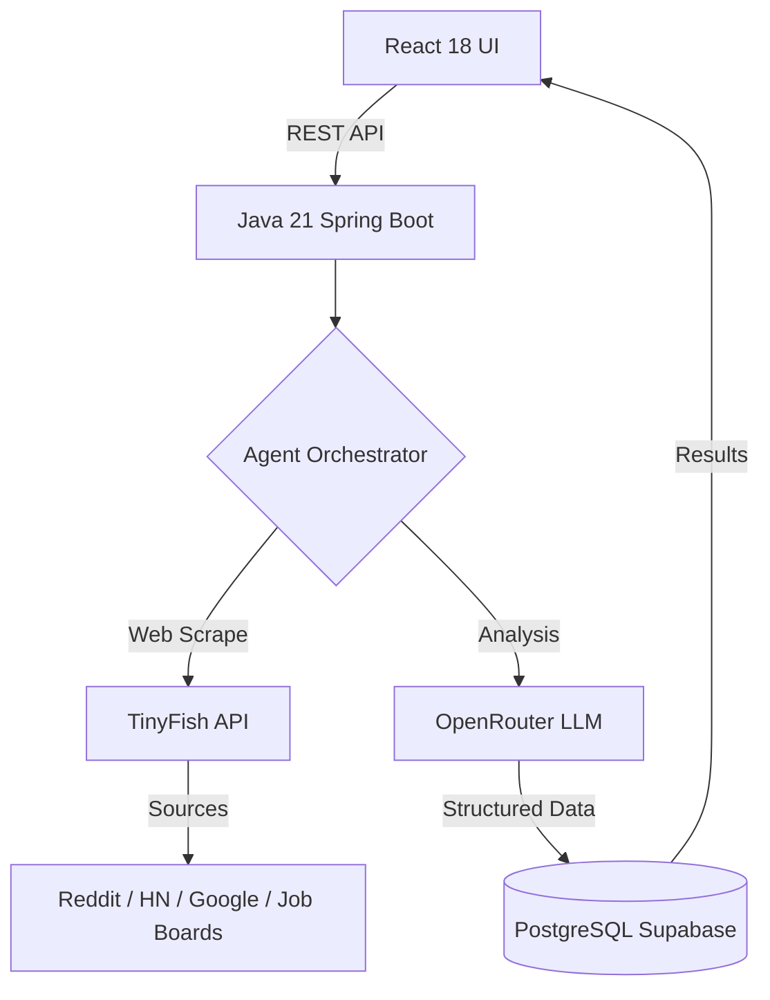

# 🚀 Traction.ai

**Live Demo:** [traction-ai-gold.vercel.app](https://traction-ai-gold.vercel.app/)  
**Test Credentials:**
* **Username:** `admin@zenohosp.com`
* **Password:** `admin@123`

---

## 📖 Overview
Traction.ai scrapes the live web using the **TinyFish Web Agent API** to deliver structured, actionable intelligence to startup founders. Each query triggers parallel web scrapes across Reddit, Hacker News, Google, competitor websites, and job boards. The raw data is then analyzed via **OpenRouter (LLM)** to produce evidence-backed recommendations.

## 🛠 Modules

| Module | Purpose |
| :--- | :--- |
| **OpinionAI** | Strategic advice grounded in real founder discussions from Reddit and HN. |
| **CompeteMap** | Live competitive analysis covering features, pricing, and market gaps. |
| **HireSignal** | Hiring intelligence including role demand and competitor strategy. |
| **InvestorRadar** | Active investors in your space and fundraising readiness. |
| **PriceLab** | Competitor pricing data and community value perception. |
| **ChurnSense** | Early warning signals from customer complaints and churn discussions. |

---

## 🏗 Architecture



## 💻 Tech Stack
* **Frontend:** React 18, Tailwind CSS
* **Backend:** Java 21, Spring Boot 3.x
* **Web Scraping:** TinyFish Web Agent API
* **LLM Analysis:** OpenRouter API 
* **Database:** PostgreSQL (Supabase)

---

## ⚙️ Setup & Installation

### Prerequisites
* **Java 21**
* **Node.js 18+**
* **PostgreSQL** (Supabase recommended)

## Execution
### Backend:

* Navigate to the backend directory.

* Run the Maven wrapper to start the application.

```Bash
cd backend
./mvnw clean spring-boot:run
```
* Frontend:

* Navigate to the frontend directory.

* Install dependencies and start the development server.

```Bash
cd frontend
npm install
npm run dev
```
